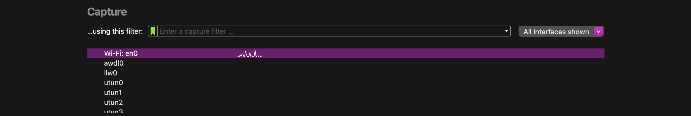
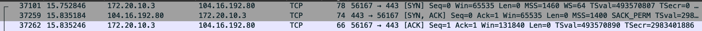
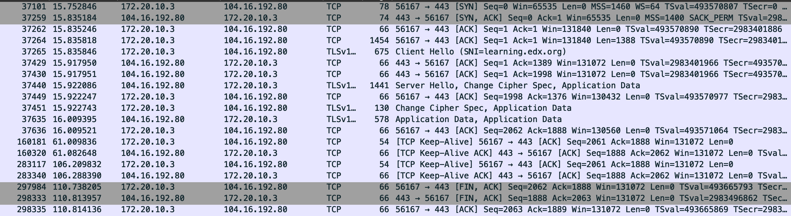
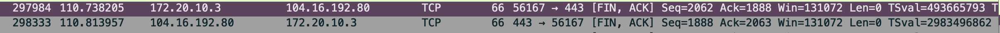
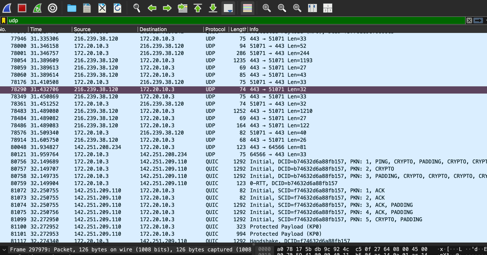

# Network Protocols Analysis Report

## Part 1: Capturing and Analyzing HTTP Traffic

### Task 1: Start Wireshark and Capture Packets
To observe unencrypted HTTP traffic, I started Wireshark and filtered for my active network interface. I then navigated to **http://neverssl.com** in my web browser. This site was chosen because it does not use HTTPS encryption, allowing us to see the cleartext HTTP headers and content.

### Task 2: Filter and Analyze HTTP Packets
I applied the filter `http` to isolate the web traffic. The capture below shows the initial `GET` request and the server's `200 OK` response.

**Detailed Packet Analysis (Frame 126942):**
* **Protocol:** HTTP/1.1
* **Response Code:** 200 OK
* **Date:** Tue, 03 Feb 2026 04:23:12 GMT
* **Server:** gunicorn/19.9.0
* **Content-Type:** `text/html; charset=utf-8`
* **Content-Length:** 9593 bytes
* **Time since request:** 163.917 ms

### HTTP Request and Response Description
* **HTTP Request:** The client sends a message to the server asking for a resource. The key line is the **Method** (e.g., `GET` to retrieve data or `POST` to send data) followed by the **URL** (Uniform Resource Locator). In my capture, the client sent `GET / HTTP/1.1`.
* **HTTP Response:** The server replies with a status line.
    * **200 OK:** The request was successful, and the content is included.
    * **404 Not Found:** The requested resource does not exist.
    * In this task, the server responded with `200 OK` and provided the HTML file.

---

## Part 2: Analyzing TCP/IP Traffic

### Task 1: Filter TCP Packets
I filtered the capture using `tcp` to view the underlying transport layer for the HTTP conversation.

### Task 2: TCP Handshake Analysis
I identified the **Three-Way Handshake** used to establish the connection between my client (`172.20.10.3`) and the server (`104.16.192.80`).

**Sequence & Acknowledgment Analysis:**
1.  **SYN (Packet 37101):**
    * **Seq:** 0
    * **Flag:** SYN
    * **Meaning:** Client initiates the connection.
2.  **SYN-ACK (Packet 37259):**
    * **Seq:** 0, **Ack:** 1
    * **Flag:** SYN, ACK
    * **Meaning:** Server acknowledges the client's SYN (Ack=0+1) and sends its own SYN.
3.  **ACK (Packet 37262):**
    * **Seq:** 1, **Ack:** 1
    * **Flag:** ACK
    * **Meaning:** Client acknowledges the server's SYN. The connection is now established.

### Step 3: Data Transfer Observation
After the connection was established, I observed the data exchange. Packet **37265** initiated the TLS handshake ("Client Hello"), followed by packet **37451** which contained the encrypted **Application Data**. The sequence numbers increased as data was transferred.

### Step 4: TCP Termination
I observed the connection closing via the FIN/ACK process.

* **Packet 297984:** Client sends `[FIN, ACK]` (Seq=2062).
* **Packet 298333:** Server responds with `[FIN, ACK]` (Ack=2063).

### TCP Header Detail (Packet Analysis)
Below is the detailed view of a TCP header from the capture.

**Header Description:**
* **Source Port:** 443 (Server/HTTPS)
* **Destination Port:** 56145 (Client)
* **Sequence Number (Raw):** 4193403285
* **Flags:** 0x010 (ACK) is set, indicating this packet is acknowledging data.
* **Header Length:** 32 bytes.
* **Window Size:** 64 (Used for flow control).
* **Checksum:** 0xfcad (Unverified).

---

## Part 3: Capturing and Analyzing UDP Traffic

### Task 2: Filter and Analyze UDP Packets
I applied the filter `udp` to observe connectionless traffic. The capture shows traffic on port 443 (likely QUIC protocol) and port 51071.

**UDP Packet Detail (Stream Index 7):**
* **Source Port:** 443
* **Destination Port:** 51071
* **Length:** 41 bytes (8 bytes header + 33 bytes data)
* **UDP Payload:** 33 bytes of data starting with `48392cb3...`

### Comparison: TCP vs. UDP Headers
* **TCP Header (Complex):** The TCP header observed in Part 2 is **32 bytes** long and contains many fields like Sequence Number, Acknowledgment Number, Flags (SYN, ACK, FIN, PSH), and Window Size. This complexity is necessary to ensure reliable, ordered delivery and error checking.
* **UDP Header (Simple):** The UDP header observed in Part 3 is only **8 bytes** long. It contains only four fields: Source Port, Destination Port, Length, and Checksum. It does not track sequence numbers or acknowledgments, making it much faster ("fire and forget") but less reliable than TCP.

## Part 4: Comparing TCP and UDP

### Task 1: Reliability and Data Integrity Comparison

| Feature | TCP | UDP | Reasons (Based on Lab Analysis) |
| :--- | :--- | :--- | :--- |
| **Reliability and Connection Establishment** | **Connection-Oriented** (Reliable) | **Connectionless** (Unreliable) | **TCP:** Uses the **3-Way Handshake** (SYN, SYN-ACK, ACK) observed in Part 2 to verify the server is ready before sending data. It also tracks delivery using ACK packets.  **UDP:** As seen in Part 3, UDP sends data immediately without a handshake ("fire and forget"). It does not verify if the receiver is ready or if the packet arrived. |
| **Data Integrity and Ordering** | **Ordered & Error-Checked** | **Unordered** | **TCP:** Uses **Sequence Numbers** (which we tracked in Part 2) to reassemble packets in the exact order they were sent. If a packet is missing, it requests a retransmission.  **UDP:** Does not track sequence numbers. Packets are processed in the order they arrive, and if one is lost or arrives out of order, it is simply dropped or accepted as-is. |

---

### Task 2: Use Cases and Performance

| Aspect | TCP | UDP |
| :--- | :--- | :--- |
| **Use Cases** | • **Web Browsing (HTTP/HTTPS):** Pages must load completely without errors. • **Email (SMTP/IMAP):** Missing text or attachments is unacceptable. • **File Transfers (FTP):** Data corruption corrupts the file. | • **Streaming Video/Audio:** Speed is critical; a few lost pixels (glitches) are better than buffering. • **VoIP (Voice calls):** Real-time conversation is prioritized over perfect audio fidelity. • **Online Gaming:** Low latency is required for player movement. |
| **Performance** | **Slower / High Overhead** The handshake, error checking, and acknowledgment process add latency (delay) to the transmission. | **Faster / Low Overhead** The simple 8-byte header and lack of error-checking allow for maximum speed and efficiency. |
