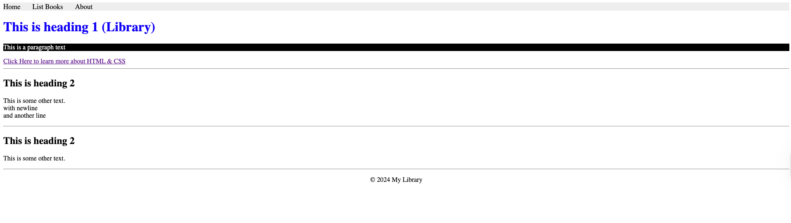
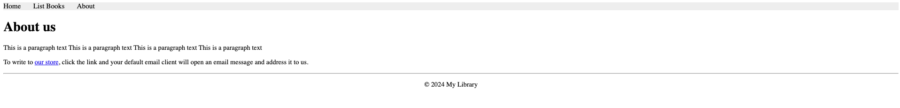
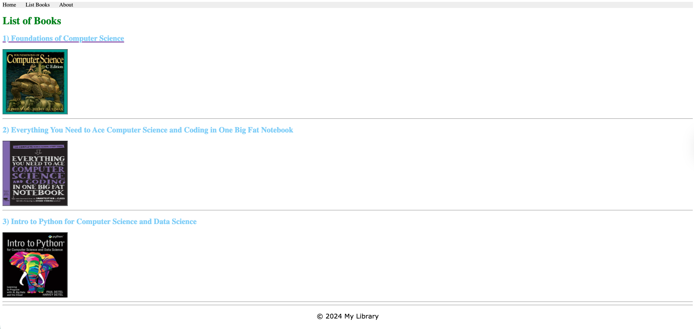
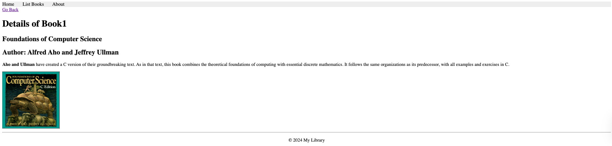
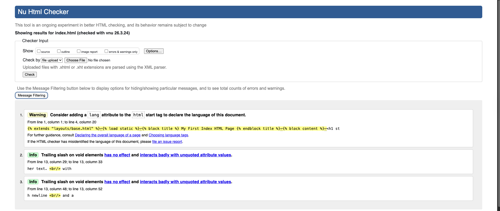

# CS471 Lab 4: HTML, CSS, and Django Templates

**Course:** CS471 - Web Technologies  
**Institution:** Qassim University, College of Computer  
**Project:** Library Website (Bookmodule)

## Overview
This repository contains the implementation of Lab 4, focusing on building a dynamic library website using HTML5, CSS3, and the Django framework. The project demonstrates the progression from static HTML pages to a fully modular Django template system using layout inheritance and static file management.

---

## Tasks Completed
1. **Task 1:** Created fundamental HTML documents (`index.html`, `aboutus.html`, `list_books.html`, `one_book.html`) using semantic tags.
2. **Task 2:** Styled the web pages using a combination of inline CSS, internal style blocks, and an external `styles.css` file.
3. **Task 3:** Validated all HTML5 syntax using the W3C Markup Validation Service.
4. **Task 4:** Integrated static files (images and CSS) into the Django framework using `` and `` tags, and configured URL routing (``).
5. **Task 5:** Refactored the architecture to use Django Template Inheritance by creating a master `base.html` layout, separated `header.html`, and `footer.html`.

---

## Webpage Screenshots & Descriptions

### 1. Home Page (Index)


**Description:** 
The Home page serves as the entry point to the Library website. It successfully extends the `base.html` layout, inheriting the external `styles.css` and the dynamic top navigation bar. It utilizes inline CSS to style the main heading and paragraph, demonstrating element-specific styling prioritization. The active tab logic in the header correctly highlights the "Home" link.

### 2. About Us Page

*Replace `screenshots/about_page.png` with the actual path to your screenshot.*

**Description:** 
The About Us page provides library contact information and a `mailto:` link. Like all pages, it dynamically includes the global header and footer components. The Django URL resolver successfully identifies the current route to apply the `.active` CSS class to the "About" navigation tab.

### 3. List of Books Page

*Replace `screenshots/list_books_page.png` with the actual path to your screenshot.*

**Description:** 
This page displays a catalog of available books. It utilizes an internal `<style>` block (injected into the base layout's `stylesheets` block) to uniquely format the `h1`, `h2`, and `p` tags specifically for this view. All book cover images are served locally through Django's `` template tag. Clicking a book title or image triggers a parameterized Django URL route (``) to load the specific book details.

### 4. Single Book Details Page

*Replace `screenshots/one_book_page.png` with the actual path to your screenshot.*

**Description:** 
This dynamic view renders the detailed information for a specific book selected from the catalog. It effectively processes the URL parameter (`bookId`) passed from the routing configuration. A functional "Go Back" link is implemented using the `` tag to seamlessly return the user to the catalog.

### 5. W3C HTML5 Validation (Optional but recommended)

*Replace `screenshots/w3c_validation.png` with a screenshot of your W3C passing screen.*

**Description:** 
Verification that the generated HTML output complies with W3C HTML5 syntax standards, ensuring cross-browser compatibility and structural integrity.

---

## How to Run the Project
1. Ensure Python and Django are installed within your virtual environment.
2. Navigate to the root directory of the project (where `manage.py` is located).
3. Start the development server:
   ```bash
   python manage.py runserver
